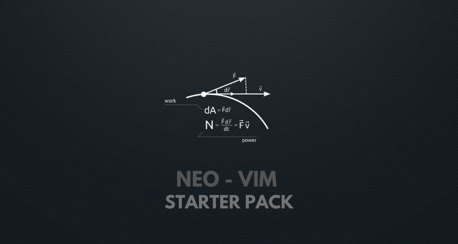

# Neo-Vim-Starter-Pack

>A guided configuration  to setup your neo-vim as a fully featured IDE
>

<br>

* ##  Create a config file for your neo-vim

```html
  mkdir ~/.config/nvim
  touch ~/.config/nvim/init.vim
```

> *  All configurations will be stored in the  **nvim** folder created within your .config folder 
> * The  **init.vim** file  will be responsible for all your neovim configuration

<br>

* ##  Install Vim-Plug to manage plugins for neo-vim

```html
curl -fLo ~/.config/nvim/autoload/plug.vim --create-dirs https://raw.githubusercontent.com/junegunn/vim-plug/master/plug.vim
```
> *  This will create an **autoload directory** inside your nvim folder and install **vim-plug** there.
> *  The autoload directory is necessaary as it instructs everything in it, here vim-plug  to **automatically load** when neovim starts up.
> *  [Referr here](https://github.com/junegunn/vim-plug) for more information.

<br>

* ##  Setup plugins for neo-vim

```html
mkdir ~/.config/nvim/vim-plug
touch ~/.config/nvim/vim-plug/plugins.vim
```
> *  All plugin configurations will be stored in the  **vim-plug** folder created within your nvim folder. 
> * The  **plugins.vim** file  will be responsible for all your plugins configuration.

<br>

Copy this into your **plugins.vim** and save it

```html
" auto-install vim-plug
if empty(glob('~/.config/nvim/autoload/plug.vim'))
  silent !curl -fLo ~/.config/nvim/autoload/plug.vim --create-dirs
    \ https://raw.githubusercontent.com/junegunn/vim-plug/master/plug.vim
  "autocmd VimEnter * PlugInstall
  "autocmd VimEnter * PlugInstall | source $MYVIMRC
endif

call plug#begin('~/.config/nvim/autoload/plugged')

    " Better Syntax Support

    Plug 'sheerun/vim-polyglot'

    " File Explorer
    Plug 'scrooloose/NERDTree'

    " Auto pairs for '(' '[' '{'
    Plug 'jiangmiao/auto-pairs'

call plug#end()
```

> *  This will make sure that all your plugins are installed within the autoload directory and starts up properly everytime you load neovim.
> *  For getting started we have added some very basic plugins like **autopairs** for brackets, **vim-polygot** for better syntax hilighting and **nerd tree** to navigate directories.

<br>

Now add this to your **init.vim** 

```html
source $HOME/.config/nvim/vim-plug/plugins.vim
```
> *  This will **source** all your **plugin configuration** to init.vim which will instruct neovim about the plugins
> *  Its best practice to create such seperate directories and store configurations and later sourcing them instead of messing up our init.vim file

<br>

* ##  Install your plugins

Open up neo-vim and run :

```html
:PlugInstall
```
> * This would **install** all the plugins we added in our **plugins.vim** file.

Here are some other useful commands perfatining to plugins
| Command                        | Action                                                               |  
| :----------------------------: | :-----------------------------------------------------------------:  |                                     
| :PlugStatus                    |  *Check wether all plugins are insalled **correctly.** *             | 
| :PlugClean                     |  *Remove plugins which are no longer defined in **plugins.vim.** *   |
| :PlugUpdate                    |  * **Update** all your plugins.*                                     |
| :PlugUpgrade                   |  *Update **vim-plug.** *                                             |


